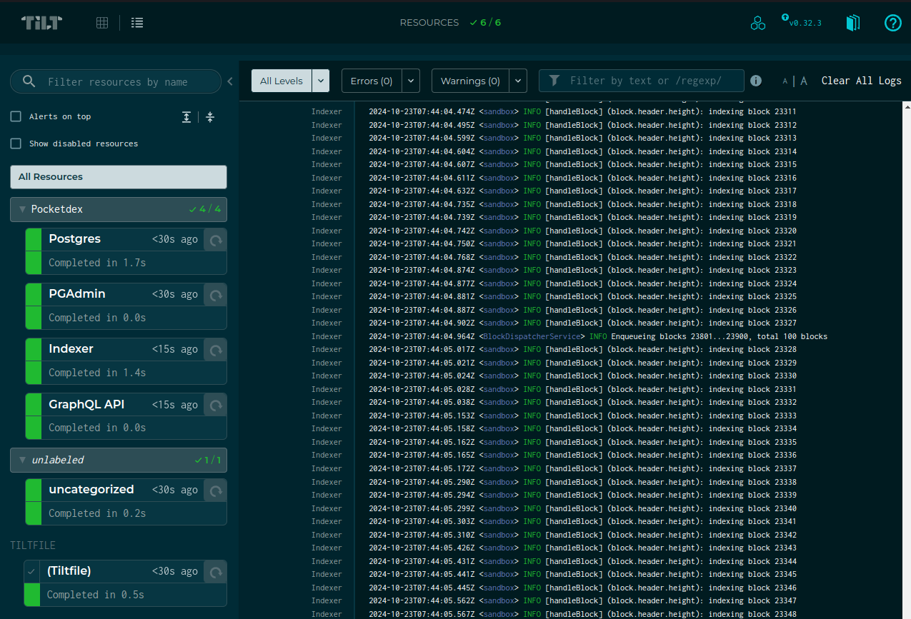

<br/>

<br/>


# Pocketdex <!-- omit in toc -->

Pocketdex is an indexer for the Shannon implementation of the pocket network protocol.

It is built using the [SubQuery](https://subquery.network) SDK, which wraps
[postgraphile](https://www.graphile.org/postgraphile/) to provide a robust GraphQL
API to the indexed data.

To learn more about SubQuery, [see their docs](https://academy.subquery.network).

- [Usage \& Query Docs](#usage--query-docs)
  - [Explore via postgres](#explore-via-postgres)
  - [Explore via GraphQL](#explore-via-graphql)
- [Getting Started](#getting-started)
  - [tl;dr local development (if not your first time)](#tldr-local-development-if-not-your-first-time)
  - [1. Install dependencies](#1-install-dependencies)
  - [2. Generate types](#2-generate-types)
  - [3a. Run via Tilt](#3a-run-via-tilt)
  - [3b. Run via docker-compose](#3b-run-via-docker-compose) 
    - [Localnet ONLY](#localnet-only)
    - [3b.1 Debugging, errors running \& building](#31-debugging-errors-running--building)
    - [3b.2 Using a pre-built image](#32-using-a-pre-built-image)
    - [3b.3 Available Scripts breakdown](#33-available-scripts-breakdown)
  - [3c. Using k8s](#3c-using-k8s)

## Usage & Query Docs

See the [introduction docs](./docs/introduction.md) directory for details
on how to use indexed data after you're fully set up.

### Explore via postgres

Connect to the postgres container, update the schema, and explore!

```bash
yarn docker:compose development exec -it postgres -- psql -U postgres -d postgres
SET SCHEMA "testnet";
# OR, if indexing localnet:
# SET SCHEMA "localnet";
SET search_path TO app;
\dt
```

### Explore via GraphQL

Navigate to http://localhost:3000 or the port you specified in .env.development at `SUBQUERY_GRAPHQL_ENGINE_PORT` var.

<details>
  <summary>Click to expand sample query</summary>

  ```graphql
    query  {
        distinct_poktroll_event_types: events (distinct: TYPE, filter: {type: {includes: "poktroll"}}){
        totalCount
        nodes {
          type
        }
      }

      distinct_poktroll_message_types: messages (distinct: TYPE_URL, filter:{typeUrl: {includes: "poktroll"}}) {
        totalCount
        nodes {
          typeUrl
          # transactionId
        }
      }

      unprocessedEntities (distinct: ERROR) {
        totalCount
        nodes {
          eventId
          messageId
          transactionId
          error
        }
      }

      indexer_metadata: _metadata {
        targetHeight
        lastProcessedHeight
      }


      # tx_events: events(filter: {type: {equalTo: "tx"}}) {
      #   nodes {
      #     attributes {
      #       nodes {
      #         key
      #         value
      #       }
      #     }
      #   }
      # }

      # begin_block_events: events (filter: {attributes: {some: {key: {equalTo: "mode"}, value: {equalTo: "BeginBlock"}}}}) {
      #   nodes {
      #     attributes {
      #       nodes {
      #         key
      #         value
      #       }
      #     }
      #   }
      # }

      # events (distinct: TYPE) {
      #   nodes {
      #     type
      #   }
      # }

      # claims: messages(filter: {typeUrl: {equalTo: "/poktroll.proof.MsgCreateClaim"}}) {
      #   nodes {
      #     typeUrl
      #     json
      #   }
      # }

      # eventAttributes(distinct: KEY) {
      #   nodes {
      #     key
      #   }
      # }
  }
  ```

</details>

## Getting Started

This is the bare minimum to be here.

```bash
yarn install
yarn run codegen
docker context use default # Optional
```

### tl;dr local development (if not your first time)

Localnet - Run the following:

1. Modify `.env.development` to use localnet values (have a comment highlighting them)
2. Run:

```bash
yarn run docker:build:development
# before this be sure you have localnet of poktroll running. 
# Check https://dev.poktroll.com/develop/networks/localnet
yarn poktroll:proxy:start 
yarn run docker:start:development # Optionally add -d if u want to detach the terminal
```

Testnet (alpha or beta):

1. For beta skip this. For alpha or any other first edit `.env.development`
2. Run:

```bash
yarn run docker:build:development
yarn run docker:start:development # Optionally add -d if u want to detach the terminal
```

### 1. Install dependencies

```shell
yarn install
```

### 2. Generate types

Types will need to be regenerated any time the `graphql.schema` is changed.

```shell
yarn run codegen
```

### 3a. Run via [Tilt](https://tilt.dev/)



```bash
# Start tilt
tilt up

# Delete tilt resources
tilt down
```

#### Running against localnet

_NOTE: 🚨 The [poktroll](https://github.com/pokt-network/poktroll) localnet includes pocketdex in its tilt environment. 🚨_

If you need to run pocketdex against poktroll localnet, but can't use the poktroll repo's tilt environment for whatever reason, update (_but don't commit_) the `indexer_values_path` in the `Tiltfile`:

```diff
  load("./tiltfiles/pocketdex.tilt", "pocketdex")
  pocketdex("./",
            genesis_file_name="testnet.json",
            postgres_values_path="./tiltfiles/k8s/postgres/postgres-values.yaml",
            pgadmin_values_path="./tiltfiles/k8s/pgadmin/pgadmin-values.yaml",
-           indexer_values_path="./tiltfiles/k8s/indexer/dev-testnet-indexer-values.yaml",
+           indexer_values_path="./tiltfiles/k8s/indexer/dev-localnet-indexer-values.yaml",
            gql_engine_values_path="./tiltfiles/k8s/gql-engine/dev-gql-engine-values.yaml")
```

Tilt will automatically apply the change on save.

### 3b. Run via docker-compose

Dotenv files will be automatically created after the `yarn install` thanks to the `postinstall` script.
After that, feel free to modify them as you wish.

You will see three dotenv files, each for the corresponding script and environment:

* `.env.production`
* `.env.development`
* `.env.test`

Alternatively, you can manually create them running:

```shell
yarn run env:prepare
```

For this README we will be running all the commands in `development` but you can also run them in `test` or `production`.
Following this structure, you can run every docker command `docker:<cmd>:<production|development|test>`,

#### Localnet ONLY

```shell
# Run this ONLY IF indexing poktroll localnet.
# This will allows subquery-node to connect with the poktroll validator

# Leave this open in a separated terminal. Interrupting the terminal will stop the container.
yarn poktroll:proxy:start

# To stop and remove the proxy
yarn poktroll:proxy:stop
```

Build & start:

```shell
# Then build docker and start
yarn run docker:build:development
# This will turn on the process under a WATCHER so any change to the project.ts schema.graphql or src will trigger
# the needed builds again.
yarn run docker:start:development
```

Stop (without deleted data)

```shell
yarn run docker:stop:development
```

Or Stop & clean up (delete postgres data):

```shell
yarn run docker:clean:development
```

#### 3b.1 Debugging, errors running & building

If you're hitting errors with the above command, do a nuclear clean of all potential issues:

```bash
yarn cache clean
docker builder prune --all
docker context use default
```

Now pick up from the `yarn run docker:build` step above.

#### 3b.2 Using a pre-built image

If you are unable to build locally, a pre-built image is available on Docker Hub: [bryanchriswhite/pocketdex-subquery-node:latest](https://hub.docker.com/r/bryanchriswhite/pocketdex-subquery-node).

To use this image, pull it down:

```shell
docker pull bryanchriswhite/pocketdex-subquery-node:latest
```

Then, re-tag the image to match what docker compose is expecting (assumes the repo root dir is `pocketdex`):

```shell
docker tag bryanchriswhite/pocketdex-subquery-node:latest pocketdex-subquery-node:latest
```

**Alternatively**, you may update the `docker-compose.<env>.yml` file, just remember not to commit this change:

```yaml
services:
  indexer:
    image: bryanchriswhite/pocketdex-subquery-node:latest
    ...
```

#### 3b.3 Available Scripts breakdown

### General Scripts

- **`preinstall`**  
  Ensures that Yarn is used as the package manager by running `npx only-allow yarn`.

- **`postinstall`**  
  Runs the `env:prepare` script and prepares the `.env` files.  
  Builds vendor packages and generates SubQL code.

- **`clean:all`**  
  Removes all `node_modules` folders by executing the `remove-all-node-modules.sh` script.

- **`precommit`**  
  Runs a script to handle operations before a commit is made.

---

### Build and Development Scripts

- **`codegen`**  
  Executes SubQL code generation using `subql codegen`.

- **`build`**  
  Executes a complex build script located at `scripts/build.sh`.

- **`watch:build`**  
  Similar to the `build` script but runs without the linter.  
  Useful for real-time development with nodemon.

- **`test`**  
  Builds the project and runs tests with `subql-node-cosmos`.

- **`test:ci`**  
  Runs tests in a specific CI environment using the SubQL Cosmos package.

---

### Linting and Formatting

- **`lint`**  
  Runs ESLint on the `src` directory with a `.ts` extension.

- **`lint:fix`**  
  Runs ESLint on the same files as the `lint` script but also fixes auto-resolvable issues.

- **`format`**  
  Formats the code using Prettier based on the project-defined rules.

- **`format:ci`**  
  Checks code formatting using Prettier without applying changes.  
  Intended for CI pipelines.

---

### Environment and Vendors Setup

- **`env:prepare`**  
  Prepares `.env` files for various environments (e.g., `development`, `test`, `production`) using a helper script.

- **`vendors:build`**  
  Builds vendor packages using `vendor-builder.js`.

- **`vendors:reset`**  
  Updates vendor submodules and rebuilds vendor packages.

---

### Docker Operations

- **`docker:compose`**  
  A general-purpose script that wraps commands or scripts to handle Docker operations.

- **`docker:check-env:<environment>`**  
  Ensures the required `.env.<environment>` files exist.  
  This is available for `production`, `development`, and `test`.

- **`docker:build:<environment>`**  
  Builds Docker images for the specified environment.  
  Optionally, a `no-cache` version is available via `docker:build:no-cache:<environment>`.

- **`docker:start:<environment>`**  
  Starts all services for a specified environment using Docker Compose.

- **`docker:ps:<environment>`**  
  Displays the status of services in the specified environment.

- **`docker:stop:<environment>`**  
  Stops all services for the specified environment (without removing them).

- **`docker:clean:<environment>`**  
  Stops and removes all services, along with associated volumes and networks, for the environment.

---

### Other Custom Scripts

- **`poktroll:proxy:start`** and **`poktroll:proxy:stop`**  
  Start and stop a proxy tunnel for interacting with the local validator via the `proxy-tunnel.sh` script.

- **`poktroll:update-proto-files`**  
  Executes the `copy-poktroll-files.sh` script to update protocol files for `poktroll`.

### 3c. Using k8s

See the instructions in [docs/kubernetes.md](./docs/kubernetes.md) for deploying using Kubernetes.
